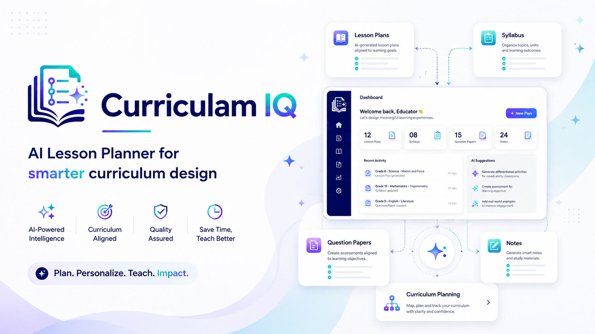

<p align="center"></p>
<h1 align="center">curriculamIQ</h1>
<p align="center">A focused AI workspace for educators to create, adapt, review, and export classroom-ready learning materials.</p>
<p align="center">
  <a href="#quick-start"></a>
  <a href="https://curriculaiq.in"></a>
</p>
<p align="center">
  <a href="https://react.dev"></a>
  <a href="https://www.typescriptlang.org"></a>
  <a href="https://vite.dev"></a>
  <a href="https://www.mongodb.com"></a>
</p>

## What it does
curriculamIQ helps educators turn a teaching goal into structured, editable first drafts. It supports lesson plans, lesson sequences, quizzes, question papers, study notes, syllabi, concept maps, classroom materials, and PDF/DOCX export. AI output remains a draft: educators review it before use.

## Highlights
- **Plan with context** — begin with subject, year group, learning objectives, and classroom constraints.
- **Generate connected materials** — create lessons, assessments, notes, and supporting resources in one workspace.
- **Adapt purposefully** — vary scaffolding, challenge, activities, and delivery while keeping learning goals clear.
- **Keep control** — edit drafts, organise saved work, and export polished PDF or DOCX documents.
- **Work responsibly** — avoid student identifiers and sensitive data; review all AI-generated content.

## Quick start
**Prerequisites:** Node.js 20+ and npm; an Auth0 tenant, MongoDB deployment, and Google Gemini API key.
```bash
npm install
Copy-Item .env.example .env
npm run dev
```
Open the local URL printed by Vite. For a production build, run `npm run build`.

## Configuration
Copy `.env.example` and set the required values below. Do not commit secrets.
| Variable | Purpose |
| --- | --- |
| `VITE_AUTH0_DOMAIN`, `VITE_AUTH0_CLIENT_ID`, `VITE_AUTH0_AUDIENCE` | Browser Auth0 configuration |
| `AUTH0_DOMAIN`, `AUTH0_AUDIENCE` | Server-side token verification |
| `GEMINI_API_KEY`, `GEMINI_MODEL` | AI generation service |
| `MONGODB_URI`, `MONGODB_DB_NAME` | Application data storage |
| `STUDENT_SESSION_SECRET` | Student-session signing secret |
| `VITE_APP_URL` | Production origin — set to `https://curriculaiq.in` |

## Scripts
| Command | Description |
| --- | --- |
| `npm run dev` | Start the Vite development server |
| `npm run build` | Create a production build in `dist/` |
| `npm run preview` | Serve the production build locally |
| `npm run db:setup` | Initialise the MongoDB setup script using `.env` |

## Project structure
```text
api/                 Vercel API entry point and server modules
src/modules/         Feature modules: auth, curriculum, documents, generation, marketing, and user
src/shared/          Shared frontend types and utilities
scripts/             Development and data setup scripts
```

## Deployment
The repository is configured for Vercel. Set the production environment variables in Vercel, including `VITE_APP_URL=https://curriculaiq.in`, then deploy with the configured build command: `npm run build`.

## Responsible use
Use general teaching context only. Do not provide student names, identifiers, confidential records, or sensitive personal data. Review every generated draft for accuracy, accessibility, suitability, and curriculum alignment before sharing it.

---
Built for educators who want more time for teaching and less time planning.